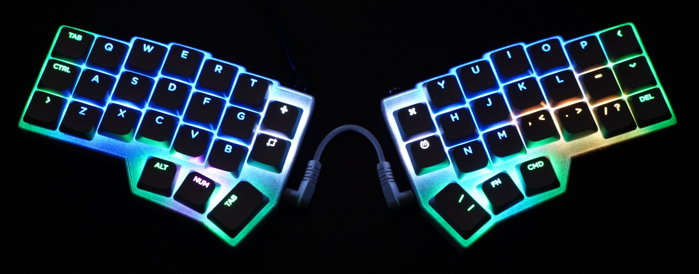

# KERIgoKBD (KERI's Ergonomic Keyboard)

けりの自作キーボードのソースコード。

```tree
kerigokbd/
├── external/
│   ├── qmk_firmware/               # QMK Firmware for VIA (git-submodule)
│   └── vial-qmk/                   # QMK Firmware for VIAL (git-submodule)
├── hardware/
│   └── kerigokbd_v1/
│       ├── case/                   # STL
│       └── pcb/                    # KiCad
├── software/
│   └── keyboards/                  # Keyboard Entries of QMK Firmware
│       └── kerigokbd/
│           ├── kerigokbd_v1/
│           │   ├── keymaps/
│           │   │   ├── default/
│           │   │   │   └── keymap.c
│           │   ├── keyboard.json
│           │   └── config.h
│           ├── rules.mk
│           ├── kerigokbd.c
│           ├── kerigokbd.h
│           └── readme.md
├── .clang-format
├── .gitmodules
└── README.md
```

## ハードウェア

- KERIgoKBD Corne v4
  - [Corne V4 Chocolate](https://github.com/foostan/crkbd)のケースをカスタマイズしたもの。
    
    
- KERIgoKBD v1
  - (設計中)

## ソフトウェア

- [software](./software/)
  - [QMK Firmware](https://qmk.fm/)のプロジェクト
