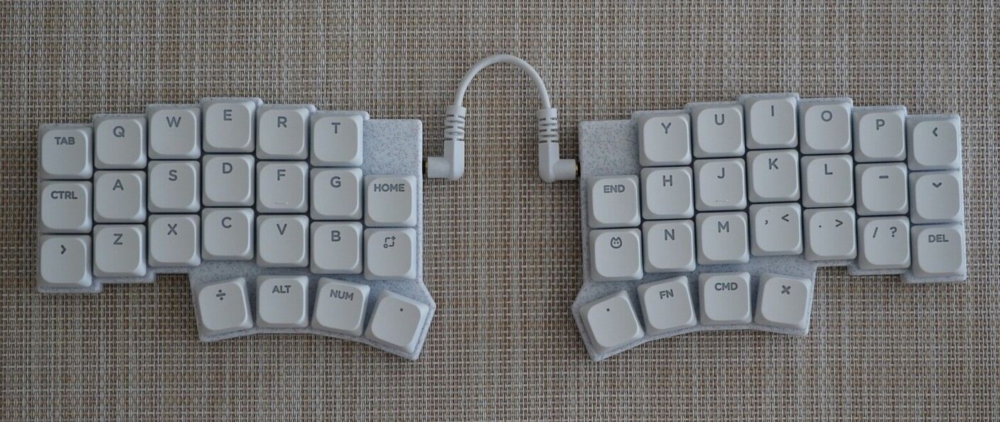
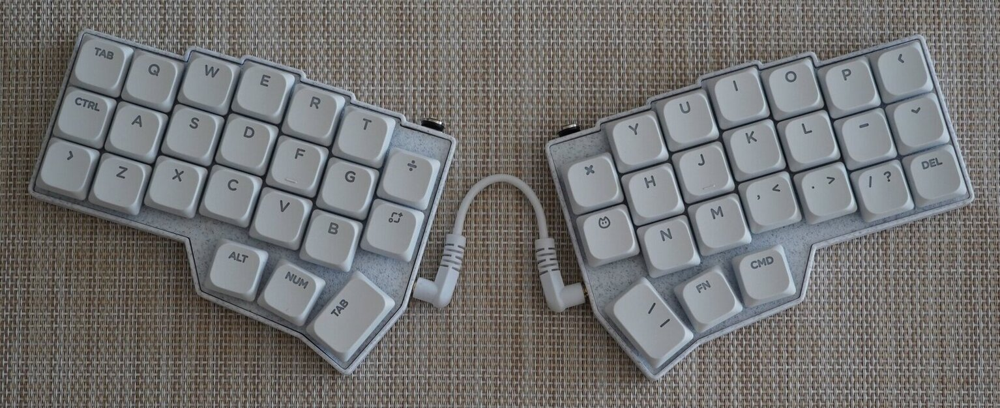
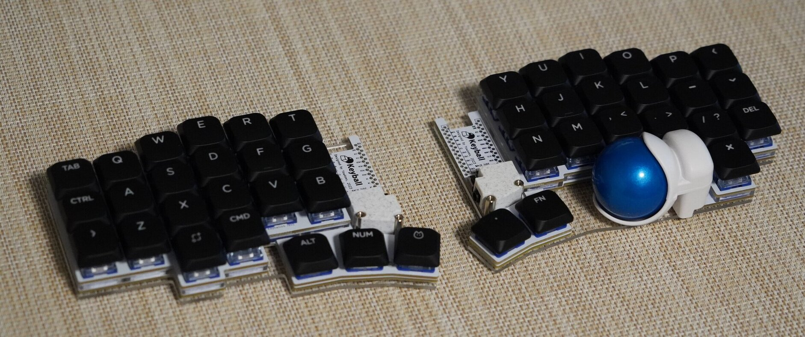

# KERIgoKBD (KERI's Ergonomic Keyboard)

けりの自作キーボードの設計データ。

```tree
kerigokbd/
├── external/
│   ├── qmk_firmware/               # QMK Firmware for VIA (git-submodule)
│   └── vial-qmk/                   # QMK Firmware for VIAL (git-submodule)
├── hardware/
│   └── kerigokbd_v1/
│       ├── case/                   # STL
│       └── pcb/                    # KiCad
├── software/
│   └── keyboards/                  # Keyboard Entries of QMK Firmware
│       └── kerigokbd/
│           ├── kerigokbd_v1/
│           ├── kerigokbd_corne_v4/
│           ├── keyball44rp/
│           └── readme.md
├── .clang-format
├── .gitmodules
└── README.md
```

## 対応キーボード一覧

### KERIgoKBD v1

[けり](https://github.com/kerikun11)のはじめての自作キーボード。

- Hardware: [KERIgoKBD v1 Design](./hardware/kerigokbd_v1/)
- Firmware: [KERIgoKBD v1 Firmware](./software/keyboards/kerigokbd/kerigokbd_v1/)



### KERIgoKBD Corne v4

[foostan](https://github.com/foostan)さんの[Corne V4 Chocolate](https://github.com/foostan/crkbd)のケースをカスタマイズしたもの。

- Hardware: https://github.com/foostan/crkbd
- Firmware: [KERIgoKBD Corne V4](./software/keyboards/kerigokbd/kerigokbd_corne_v4/)



### Keyball44 RP2040

[Yowkees](https://github.com/Yowkees)さんの[Keyball44](https://github.com/Yowkees/keyball)のマイコンボードを`RP2040 Pro Micro`に差し替えたもの。

- Hardware: https://github.com/Yowkees/keyball
- Firmware: [Keyball44 RP2040](./software/keyboards/kerigokbd/keyball44rp/)


