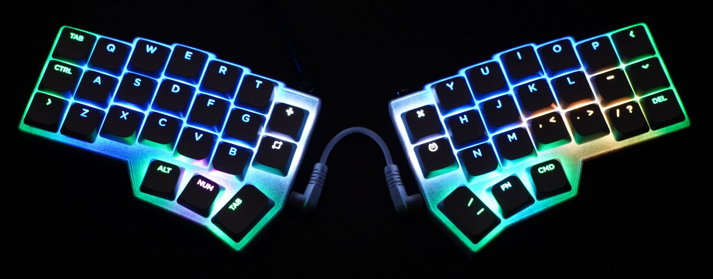

# KERI's QMK Firmware

けりの自作キーボードのファームウェア

```tree
kerigokbd/
├── external/
│   ├── qmk_firmware/               # QMK Firmware for VIA (git-submodule)
│   └── vial-qmk/                   # QMK Firmware for VIAL (git-submodule)
├── keyboards/
│   └── kerigokbd/                  # KERIgoKBD Custom Firmware
│       ├── keymaps/
│       │   └── default/
│       │       └── keymap.c
│       ├── keyboard.json
│       ├── config.h
│       ├── rules.mk
│       ├── kerigokbd.c
│       ├── kerigokbd.h
│       ├── rgb_matrix_user.inc
│       └── readme.md
├── .clang-format
├── .gitmodules
└── README.md
```

## ハードウェア

[Corne V4](https://github.com/foostan/crkbd)ベースのキーボード。




## ソフトウェア

ファームウェアのビルドと書き込みの方法

### 前提

- シンボリックリンクが作成できる環境であること
- [QMKコマンド](https://docs.qmk.fm/newbs_getting_started)がインストールされていること

### ソースコードの取得と初回セットアップ

カスタムファームウェアのディレクトリをQMKリポジトリの中にシンボリックで追加して、不要な差分が表示されないように無視設定を行う。

```sh
# clone this repository with submodules
git clone --recursive https://github.com/kerikun11/kerigokbd.git
cd kerigokbd
```

QMKファームウェアのリポジトリのkeyboardsディレクトリ内にカスタムキーボードのリンクを追加する。

```sh
./script/setup.sh
```

### VIAビルド

```sh
# go to qmk firmware directory
cd external/qmk_firmware
# setup
qmk setup
```

QMKコマンドでビルドと書き込みを行う。

```sh
# compile
qmk compile -kb kerigokbd -km default
# flash
qmk flash -kb kerigokbd -km default
```

qmk config を設定しておくと引数を省略できる。

```sh
# config
qmk config user.keyboard=kerigokbd
qmk config user.keymap=default
# compile
qmk compile
# flash (with compile)
qmk flash
```

### VIALビルド

```sh
# go to qmk firmware directory
cd external/vial-qmk
# prepare
qmk setup
```

QMKコマンドでビルドと書き込みを行う。

```sh
# compile
qmk compile -kb kerigokbd/vial -km default
# flash
qmk flash -kb kerigokbd/vial -km default
```

qmk config を設定しておくと引数を省略できる。

```sh
# config
qmk config user.keyboard=kerigokbd/vial
qmk config user.keymap=default
# compile
qmk compile
# flash (with compile)
qmk flash
```
