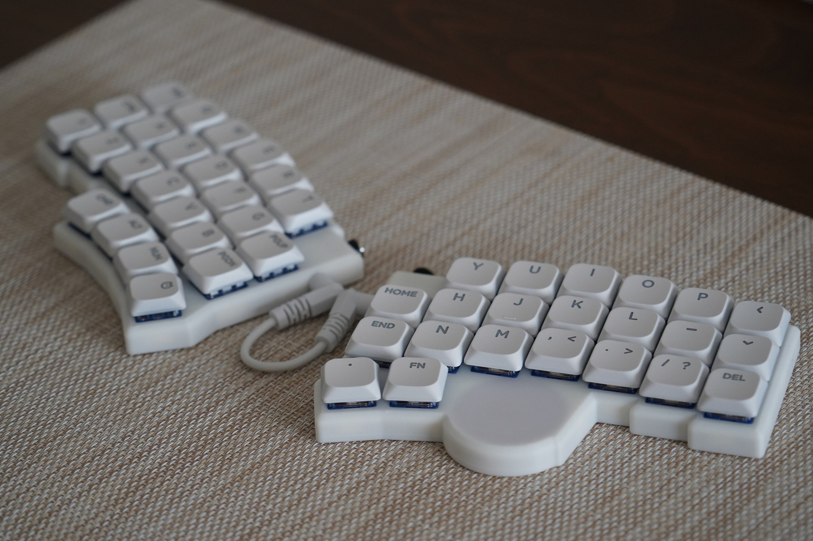

# KERIgoKBD v2 Hardware

けりの人間工学キーボード第2版のハードウェア構成。

KERIgoKBD v1.2 PCB を使用し、右手側に Cirque トラックパッドを追加した構成。

## 構成

| 項目                   | 使用パーツ                                                                                                               |
| :--------------------- | :----------------------------------------------------------------------------------------------------------------------- |
| PCB                    | [`pcb_20260222`](../pcb_20260222/)                                                                                       |
| ケース                 | [`case_20260222_trackpad`](../case_20260222_trackpad/)                                                                   |
| ファームウェア         | [`kerigokbd/kerigokbd_v2/pcb_20260222`](../../../software/qmk/keyboards/kerigokbd/kerigokbd_v2/pcb_20260222/)            |
| Keyboard Layout Editor | [KERIgoKBD v2 - Keyboard Layout Editor](https://www.keyboard-layout-editor.com/#/gists/0d82236d0943d0b74055119b50123c59) |

## PCB

KERIgoKBD v1.2 と同じ [`pcb_20260222`](../pcb_20260222/) を使用。
マイコンのピンアサインは KERIgoKBD v1.2 と同じ。

## スペック

| 項目             | 内容                                                                                                                |
| :--------------- | :------------------------------------------------------------------------------------------------------------------ |
| マイコン         | [RP2040](https://www.raspberrypi.com/products/rp2040/specifications/) (Cortex-M0+ 133MHz x2, 264kB SRAM)            |
| フラッシュ       | [W25Q16JVUXIQ](https://www.digikey.jp/ja/products/detail/winbond-electronics/W25Q16JVUXIQ-TR/) (2MB)                |
| キースイッチ     | [Kailh Deep Sea Silent Mini Low Profile Key Switch (Linear)](https://www.aliexpress.com/item/1005007364820059.html) |
| キーキャップ     | [NuPhy nSA Keycaps (Shine-through White)](https://www.aliexpress.com/item/1005006384968360.html)                    |
| キーソケット     | [Hot Swap Socket for Kailh 1350 Chocolate](https://www.aliexpress.com/item/1005006610157756.html)                   |
| トラックパッド   | [Cirque Trackpad TM035035](https://mou.sr/48nN2VQ)                                                                  |
| 左右接続ケーブル | [3.5mm AUX Cable (White 3 Pole 10cm)](https://www.aliexpress.com/item/1005002484746676.html)                        |
| USBケーブル      | [USLION Magnetic USB Type-C ケーブル](https://www.aliexpress.com/item/1005006136597761.html)                        |
| 滑り止めシート   | [GRIPLUS ホワイト フリーカット](http://www.amazon.co.jp/dp/B08XHMGPWW/)                                             |

## レイアウト

- 左右分離
- 左手24キー、右手22キー、合計46キー
- 数字キーのない40%レイアウト
- 右手側に Cirque トラックパッドを追加
- QMK Pointing Device と Auto Mouse Layer に対応
- 全キーに RGB バックライト LED

## ライセンス

This work is licensed under a [Creative Commons Attribution-NonCommercial 4.0 International License](https://creativecommons.org/licenses/by-nc/4.0/).
