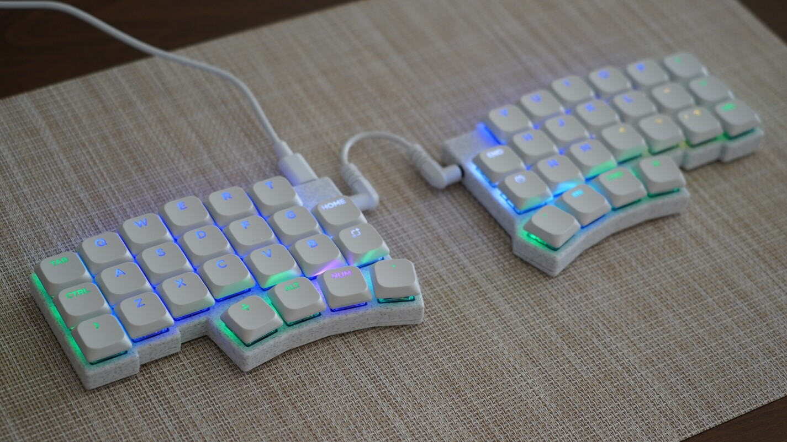
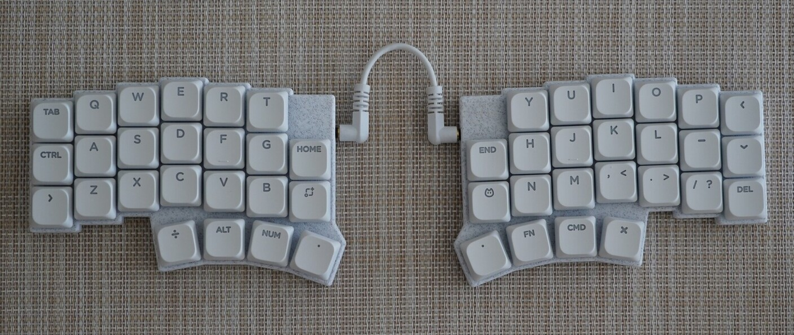
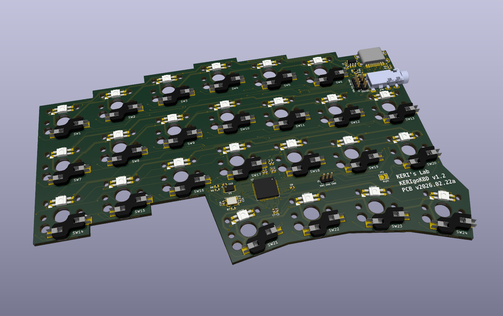

# KERIgoKBD v1

けりの人間工学キーボード第1版  
KERI's Ergonomic Keyboard Version 1

## ハードウェア

- [`v1.0.0_pcb_20241229`](./v1.0.0_pcb_20241229/)
  I2Cピンアサインにミスあり。I2C不使用なら問題なし。
- [`v1.1.0_pcb_20250208`](./v1.1.0_pcb_20250208/)
  I2Cピンアサインを修正。
- [`v1.2.0_pcb_20260222`](./v1.2.0_pcb_20260222/)
  小型化。マイコンのピンアサインに変更はないが、TRSピンアサインを変更。

## リンク集

- [KERIgoKBD v1 - Remap](https://remap-keys.app/catalog/8pqWZfIyb0UqzhvSmsgh/keymap?id=RpLYgWmZ0A9D40j9Gvdv)
- [KERIgoKBD v1 - Keyboard Layout Editor](https://www.keyboard-layout-editor.com/#/gists/e9041aa9a964c55f5b5cef199f9d24c8)
- [KERIgoKBD v1 - Firmware](../../software/qmk/keyboards/kerigokbd/kerigokbd_v1/)

## スペック

| 項目             | 内容                                                                                                                |
| :--------------- | :------------------------------------------------------------------------------------------------------------------ |
| マイコン         | [RP2040](https://www.raspberrypi.com/products/rp2040/specifications/) (Cortex-M0+ 133MHz x2, 264kB SRAM)            |
| フラッシュ       | [W25Q16JVUXIQ](https://www.digikey.jp/ja/products/detail/winbond-electronics/W25Q16JVUXIQ-TR/) (2MB)                |
| キースイッチ     | [Kailh Deep Sea Silent Mini Low Profile Key Switch (Linear)](https://www.aliexpress.com/item/1005007364820059.html) |
| キーキャップ     | [NuPhy nSA Keycaps (Shine-through White)](https://www.aliexpress.com/item/1005006384968360.html)                    |
| キーソケット     | [Hot Swap Socket for Kailh 1350 Chocolate](https://www.aliexpress.com/item/1005006610157756.html)                   |
| 左右接続ケーブル | [10cm 3.5mm AUX Cable (White 3 Pole)](https://www.aliexpress.com/item/1005002484746676.html)                        |
| 滑り止めシート   | [GRIPLUS ホワイト フリーカット](http://www.amazon.co.jp/dp/B08XHMGPWW/)                                             |
| USBケーブル      | [USLION Magnetic USB Type-C ケーブル](https://www.aliexpress.com/item/1005006136597761.html)                        |

## レイアウト

けりの手の形状に合わせた独自のレイアウト。

- 左右分離
- 左右それぞれ24キー、合計48キー
- 数字キーのない40%レイアウト
- 左右に4つずつの親指キー
- 中央に2つずつの追加キー
- 全キーに RGB バックライト LED

## 基板

KiCad で設計。JLCPCB に発注。
左右分離の各基板をひとつの基板の両面で兼用し、基板発注コストを抑制。

- 現行設計データ: [`v1.2.0_pcb_20260222/pcb`](./v1.2.0_pcb_20260222/pcb/)

## ケース

Autodesk Fusion で設計。Bambu Lab P1S と PLA White Marble で印刷。

- 現行設計データ: [`v1.2.0_pcb_20260222/case`](./v1.2.0_pcb_20260222/case/)

## ファームウェア

オープンソースプロジェクト [QMK Firmware](https://docs.qmk.fm/) のキーボードとして実装。Remap に対応。

- ソースコード: [`software/qmk/keyboards/kerigokbd/kerigokbd_v1`](../../software/qmk/keyboards/kerigokbd/kerigokbd_v1/)

## ライセンス

この作品は [クリエイティブ・コモンズ 表示-非営利 4.0 国際 ライセンス](https://creativecommons.org/licenses/by-nc/4.0/deed.ja) の下に提供されている。

This work is licensed under a [Creative Commons Attribution-NonCommercial 4.0 International License](https://creativecommons.org/licenses/by-nc/4.0/).
