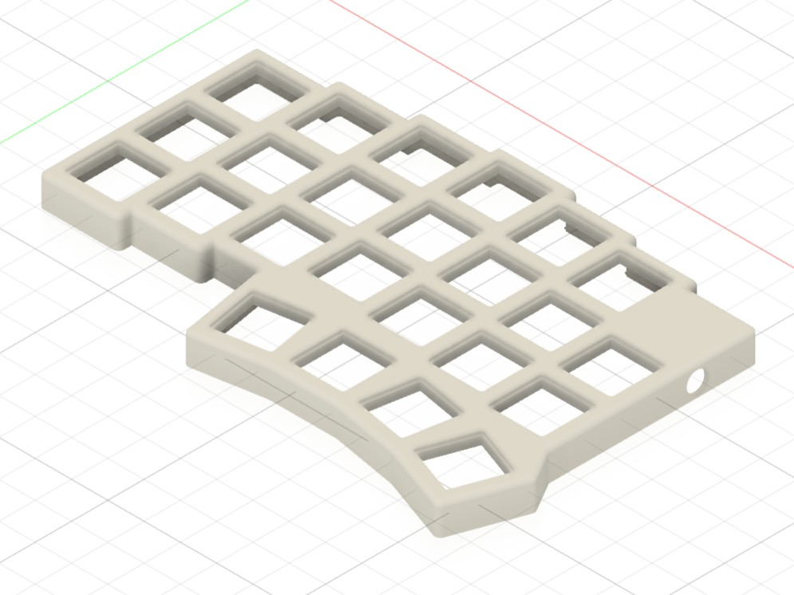
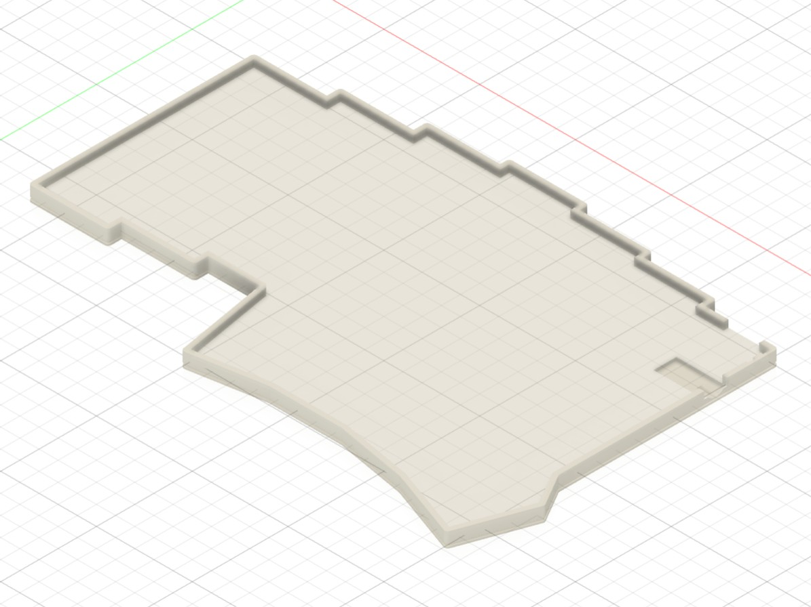

# KERIgoKBD v1

KERI's Ergonomic Keyboard Version 1

## 概要

けりの手の形状に合わせて設計した、左右分離の自作キーボード。

- 肩への負担を和らげる左右分離のキーボード
- 左右それぞれ24キー、合計48キー
- 数字キーがない、いわゆる40%レイアウト
- 左右に4つずつの親指キー
- 中央に2つずつの追加キー
- ロープロファイルのキースイッチによる薄型・軽量
- 全キーにRGBバックライトLED
- QMK Firmware / Remap 対応

## リンク

- [Remap](https://remap-keys.app/catalog/8pqWZfIyb0UqzhvSmsgh/keymap?id=RpLYgWmZ0A9D40j9Gvdv)
- [Keyboard Layout Editor](https://www.keyboard-layout-editor.com/#/gists/e9041aa9a964c55f5b5cef199f9d24c8)
- [Firmware](../../software/qmk/keyboards/kerigokbd/kerigokbd_v1/)

## 写真

## スペック

| 項目             | 内容                                                                                                                |
| :--------------- | :------------------------------------------------------------------------------------------------------------------ |
| マイコン         | [RP2040](https://www.raspberrypi.com/products/rp2040/specifications/) (Cortex-M0+ 133MHz x2, 264kB SRAM)            |
| フラッシュ       | [W25Q16JVUXIQ](https://www.digikey.jp/ja/products/detail/winbond-electronics/W25Q16JVUXIQ-TR/) (2MB)                |
| キースイッチ     | [Kailh Deep Sea Silent Mini Low Profile Key Switch (Linear)](https://www.aliexpress.com/item/1005007364820059.html) |
| キーキャップ     | [NuPhy nSA Keycaps (Shine-through White)](https://www.aliexpress.com/item/1005006384968360.html)                    |
| キーソケット     | [Hot Swap Socket for Kailh 1350 Chocolate](https://www.aliexpress.com/item/1005006610157756.html)                   |
| 左右接続ケーブル | [10cm 3.5mm AUX Cable (White 3 Pole)](https://www.aliexpress.com/item/1005002484746676.html)                        |
| 滑り止めシート   | [GRIPLUS ホワイト フリーカット](http://www.amazon.co.jp/dp/B08XHMGPWW/)                                             |
| USBケーブル      | [USLION Magnetic USB Type-C ケーブル](https://www.aliexpress.com/item/1005006136597761.html)                        |

## 基板

KiCadで設計。JLCPCBに発注。左右分離の各基板をひとつの基板の両面で兼用して、基板発注コストを抑えた。

- 設計データ: [pcb](./pcb/)

## ケース

Autodesk Fusionで設計。Bambu Lab P1S PLA White Marbleで印刷。

- 設計データ: [case](./case/)

大理石調の PLA White Marble を使うことで、見た目の雰囲気だけでなく積層痕も目立ちにくくしている。

## ファームウェア

オープンソースプロジェクト [QMK Firmware](https://docs.qmk.fm/) のキーボードとして実装。Remapに対応。

- ソースコード: [kerigokbd_v1](../../software/qmk/keyboards/kerigokbd/kerigokbd_v1/)

## ライセンス

この作品は[クリエイティブ・コモンズ 表示-非営利 4.0 国際 ライセンス](https://creativecommons.org/licenses/by-nc/4.0/deed.ja)の下に提供されている。

This work is licensed under a [Creative Commons Attribution-NonCommercial 4.0 International License](https://creativecommons.org/licenses/by-nc/4.0/).
