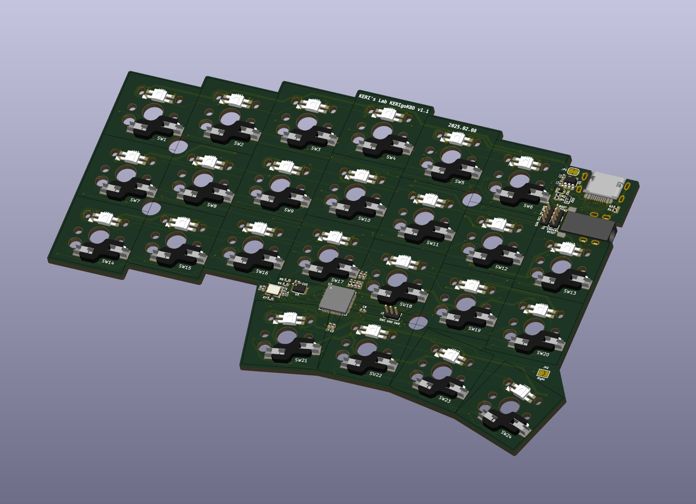

# KERIgoKBD v1

KERI's Ergonomic Keyboard Version 1

## レイアウト

## スペック

| 項目             | 内容                                                                                                                |
| :--------------- | :------------------------------------------------------------------------------------------------------------------ |
| マイコン         | [RP2040](https://www.raspberrypi.com/products/rp2040/specifications/) (Dual Cortex-M0+ 133MHz 264kB)                |
| フラッシュ       | W25Q16JVUXIQ (2MB)                                                                                                  |
| キー数           | 48 (24 + 24)                                                                                                        |
| キースイッチ     | [Kailh Deep Sea Silent Mini Low Profile Key Switch (Linear)](https://www.aliexpress.com/item/1005007364820059.html) |
| キーキャップ     | [NuPhy nSA Keycaps (Shine-through White)](https://www.aliexpress.com/item/1005006384968360.html)                    |
| 左右接続ケーブル | [10cm 3.5mm AUX Cable (White 4 Pole)](https://www.aliexpress.com/item/1005002484746676.html)                        |

## 基板

KiCadで設計。JLCPCBに発注。

<!--  -->
<!--  -->

## ケース

Autodesk Fusionで設計。Bambu Lab P1S PLA White Marbleで印刷。

## ファームウェア

QMK Firmwareに対応。

ソースコード: [kerigokbd_v1](../../software/keyboards/kerigokbd/kerigokbd_v1/)
