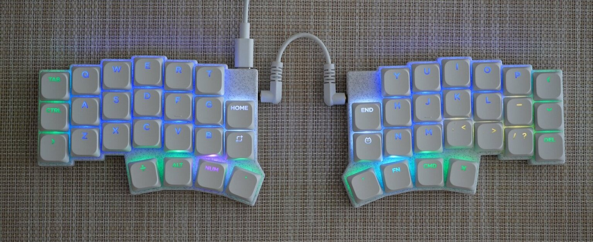
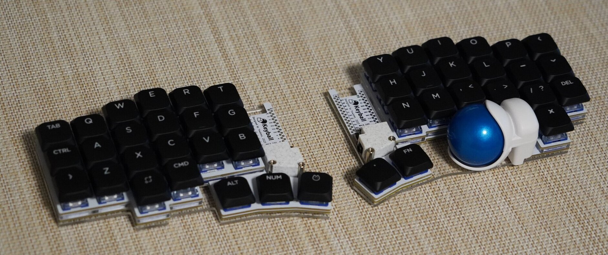

# KERIgoKBD

*KERI's Ergonomic Keyboards*

* Keyboard Maintainer: [@kerikun11](https://github.com/kerikun11)
* Hardware Supported:
  * [KERIgoKBD v1](../../../hardware/kerigokbd_v1/)
    
  * [Corne V4 Chocolate](https://github.com/foostan/crkbd)
    
  * [Keyball44](https://github.com/Yowkees/keyball) with RP2040 Pro Micro
    

Make example for this keyboard (after setting up your build environment):

    make kerigokbd/kerigokbd_v1:default
    make kerigokbd/kerigokbd_corne_v4:default
    make kerigokbd/keyball44rp:default

Flashing example for this keyboard:

    make kerigokbd/kerigokbd_v1:default:flash

See the [build environment setup](https://docs.qmk.fm/#/getting_started_build_tools) and the [make instructions](https://docs.qmk.fm/#/getting_started_make_guide) for more information. Brand new to QMK? Start with our [Complete Newbs Guide](https://docs.qmk.fm/#/newbs).

## Bootloader

Enter the bootloader in 3 ways:

* **Bootmagic reset**: Hold down the key at Q or P and plug in the keyboard
* **Physical reset button**: Briefly press the button on the back of the PCB
* **Keycode in layout**: Press the key mapped to `QK_BOOT` if it is available
